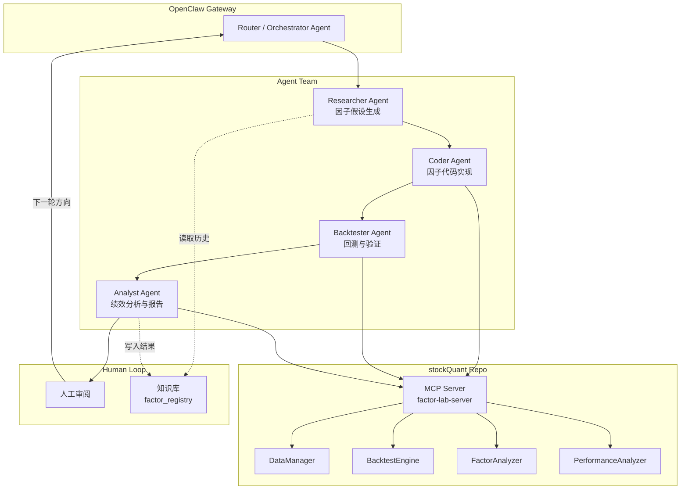
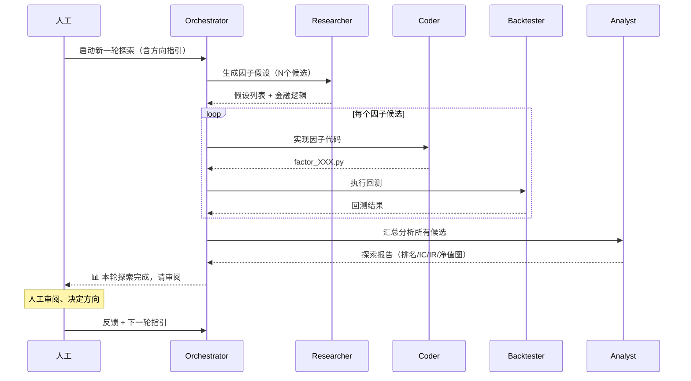

### openclaw-multi-agent-alpha-explorer ###
基于 OpenClaw Multi-Agent 框架，为 stockQuant 仓库设计并实现一套"因子探索 → 回测验证 → 人工审阅 → 迭代优化"的自动化 Alpha 因子研发系统。

# 基于 OpenClaw Multi-Agent 的 Alpha 因子自动探索系统

## 背景与目标

当前 stockQuant 仓库已具备完整的量化基础设施：数据管理(`DataManager`)、回测引擎(`BacktestEngine`)、因子分析(`FactorAnalyzer`)、绩效评估(`PerformanceAnalyzer`)以及 Alpha101 研究框架(`AlphaResearcher`)。

本计划利用 OpenClaw 的 Multi-Agent 协作架构，构建一组专业化 Agent 团队，实现**因子假设生成 → 代码实现 → 回测验证 → 绩效评估 → 人工审阅 → 迭代优化**的闭环研发流程。采用"人工参与迭代"模式：Agent 团队完成一轮探索后暂停，人工审阅结果后决定下一步方向。

## User Review Required

> [!IMPORTANT]
> OpenClaw 目前处于评估阶段，本计划先完成架构设计和仓库侧的适配代码开发。OpenClaw 的安装配置由用户自行完成。

> [!WARNING]
> 因子探索涉及大量 LLM 调用（生成假设、编写代码、分析结果），需要评估 API 调用成本。建议初期每轮探索限制在 5~10 个因子候选。

## 整体架构



### Agent 角色设计

| Agent | 职责 | 核心能力 |
|-------|------|----------|
| **Orchestrator** | 流程调度、轮次管理 | 解析人工指令、分配任务、控制暂停/恢复 |
| **Researcher** | 因子假设生成 | 读取金融文献/已有因子库，生成新因子假设 |
| **Coder** | 因子代码实现 | 将假设转为 Python 代码，集成到 stockQuant |
| **Backtester** | 回测执行 | 调用回测引擎，生成权益曲线和交易日志 |
| **Analyst** | 绩效分析与报告 | IC/IR 分析、分组回测、生成探索报告 |

### 数据流：单轮探索流程



---

## Proposed Changes

### 1. MCP Server — Agent 与 stockQuant 的桥梁

为 OpenClaw Agent 提供标准化的 MCP (Model Context Protocol) 工具接口，使 Agent 可以调用 stockQuant 的核心功能。

#### [NEW] [factor_lab_server.py](file:///Users/mingshan.yao/stockQuant/stockquant/mcp/factor_lab_server.py)

MCP Server 入口，注册以下工具供 Agent 调用：

- `compute_alpha101(alpha_id)` — 计算 Alpha101 因子面板
- `compute_custom_factor(expression, name)` — 计算自定义表达式因子
- `run_backtest(factor_name, params)` — 执行单因子回测
- `analyze_factor(factor_name)` — IC/IR/分组回测分析
- `get_performance_report(backtest_id)` — 获取绩效报告
- `list_factors()` — 列出已注册因子
- `save_factor(name, code, metadata)` — 保存因子到注册表

```diff
+ stockquant/mcp/__init__.py
+ stockquant/mcp/factor_lab_server.py
+ stockquant/mcp/tools.py          # 工具函数实现
```

#### [NEW] [tools.py](file:///Users/mingshan.yao/stockQuant/stockquant/mcp/tools.py)

MCP 工具的具体实现，封装 stockQuant 已有模块：

```python
# 核心工具函数签名
def compute_alpha101(alpha_id: int, start_date: str, end_date: str) -> dict
def compute_custom_factor(expression: str, name: str) -> dict
def run_single_backtest(factor_name: str, max_positions: int, rebalance_freq: int) -> dict
def analyze_ic_ir(factor_name: str) -> dict
def generate_report(backtest_id: str) -> dict
```

---

### 2. 因子注册表 — 探索成果的持久化

#### [NEW] [factor_registry.py](file:///Users/mingshan.yao/stockQuant/stockquant/research/factor_registry.py)

因子注册表，管理所有发现的因子的元数据、代码、绩效指标：

- 因子注册/查询/更新/标记（promising / rejected / archived）
- JSON 持久化存储到 `data/factor_registry/`
- 支持按 IC、IR、夏普比率等排序检索
- 记录每轮探索的上下文（假设来源、人工反馈）

```python
@dataclass
class FactorRecord:
    name: str
    category: str          # alpha101 / custom_expr / ml_based
    expression: str        # 因子表达式或代码路径
    hypothesis: str        # 金融逻辑假设
    ic_mean: float
    ir: float
    sharpe: float
    max_drawdown: float
    status: str            # promising / rejected / archived / pending
    created_at: str
    exploration_round: int
    human_feedback: str
```

---

### 3. 自定义表达式因子引擎

#### [NEW] [expr_engine.py](file:///Users/mingshan.yao/stockQuant/stockquant/research/expr_engine.py)

安全的因子表达式解析与计算引擎，支持 Agent 动态生成因子：

- 基于 AST 的安全表达式解析（禁止危险操作）
- 内置算子：`rank()`, `delay()`, `ts_mean()`, `ts_std()`, `ts_corr()`, `delta()`, `returns()` 等
- 输入：价量面板数据 (open/high/low/close/volume)
- 输出：(日期 x 股票代码) 的因子面板 DataFrame

```python
# Agent 可以生成这样的表达式
expr = "rank(ts_corr(close, volume, 10)) - rank(ts_mean(returns(close, 1), 20))"
panel = ExprEngine(dataset).evaluate(expr)
```

---

### 4. 探索轮次管理器

#### [NEW] [exploration_manager.py](file:///Users/mingshan.yao/stockQuant/stockquant/research/exploration_manager.py)

管理多轮探索的生命周期：

- 创建/加载/保存探索轮次
- 每轮记录：候选因子列表、回测结果、分析报告、人工反馈
- 生成 Markdown 格式的探索日志（保存到 `notebooks/explorations/`）
- 支持恢复中断的探索

```python
class ExplorationRound:
    round_id: int
    status: str            # running / paused / completed
    direction: str         # 人工给出的探索方向
    candidates: list       # 候选因子
    results: dict          # 回测结果
    report_path: str       # 报告路径
    human_feedback: str    # 人工审阅反馈
```

---

### 5. OpenClaw Agent 配置

#### [NEW] [openclaw.json](file:///Users/mingshan.yao/stockQuant/openclaw.json)

OpenClaw 网关配置，定义 Agent 团队和路由规则。

#### [NEW] 各 Agent 的 Workspace 配置

```diff
+ agents/researcher/SOUL.md      # Researcher Agent 的人格与指令
+ agents/researcher/IDENTITY.md
+ agents/coder/SOUL.md           # Coder Agent 的人格与指令
+ agents/coder/IDENTITY.md
+ agents/backtester/SOUL.md      # Backtester Agent 的人格与指令
+ agents/backtester/IDENTITY.md
+ agents/analyst/SOUL.md         # Analyst Agent 的人格与指令
+ agents/analyst/IDENTITY.md
```

每个 Agent 的 SOUL.md 将包含：
- 角色定义与专业领域
- 可调用的 MCP 工具列表
- 输出格式规范
- 与其他 Agent 的协作协议

---

### 6. 配置与依赖更新

#### [MODIFY] [pyproject.toml](file:///Users/mingshan.yao/stockQuant/pyproject.toml)

新增 `mcp` 可选依赖组：

```diff
+ mcp = ["mcp>=1.0.0", "uvicorn>=0.30.0"]
```

#### [MODIFY] [default.yaml](file:///Users/mingshan.yao/stockQuant/config/default.yaml)

新增因子探索相关配置：

```diff
+ # ---------- 因子探索设置 ----------
+ exploration:
+   max_candidates_per_round: 10
+   default_backtest_period: "2020-01-01~2025-12-31"
+   factor_registry_path: ./data/factor_registry
+   report_output_path: ./notebooks/explorations
```

---

## Verification Plan

### Automated Tests

```bash
# 1. 表达式引擎单元测试
pytest tests/test_expr_engine.py -v

# 2. 因子注册表 CRUD 测试
pytest tests/test_factor_registry.py -v

# 3. 探索管理器流程测试
pytest tests/test_exploration_manager.py -v

# 4. MCP Server 工具函数测试
pytest tests/test_mcp_tools.py -v

# 5. 端到端集成测试（模拟一轮探索）
pytest tests/test_e2e_exploration.py -v
```

### Manual Verification

- 用户自行安装 OpenClaw 并配置 Agent 团队
- 启动 MCP Server，验证 Agent 可以调用 stockQuant 功能
- 执行一轮完整的因子探索流程，验证人工审阅暂停机制
- 检查探索报告的可读性和因子注册表的完整性


updateAtTime: 2026/5/11 14:20:21

planId: 7caae312-7faf-4912-af1b-e45a804785ee