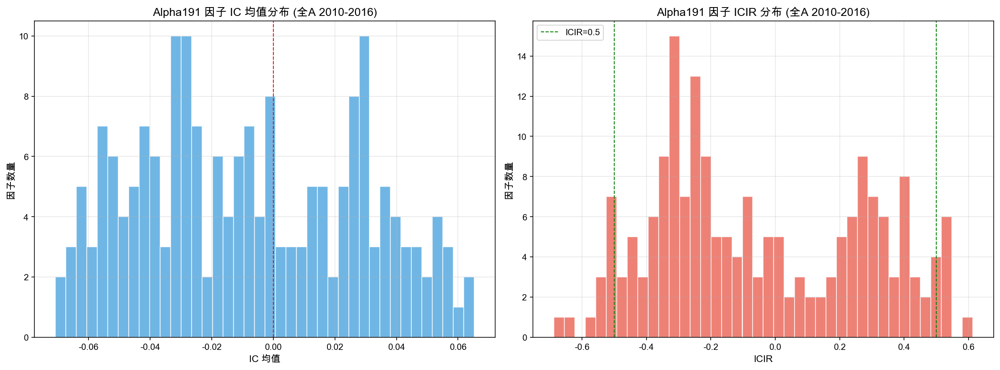
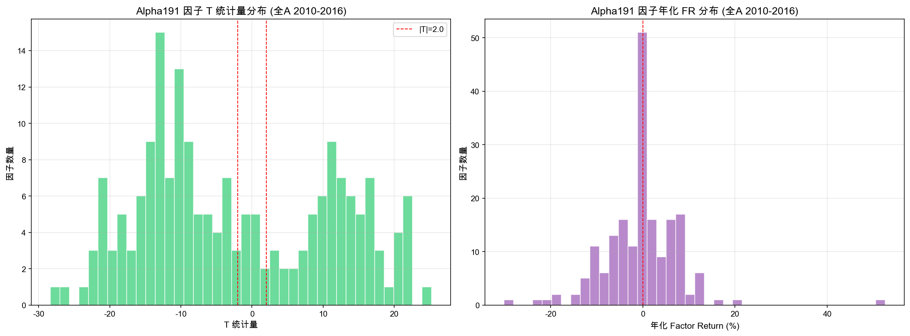
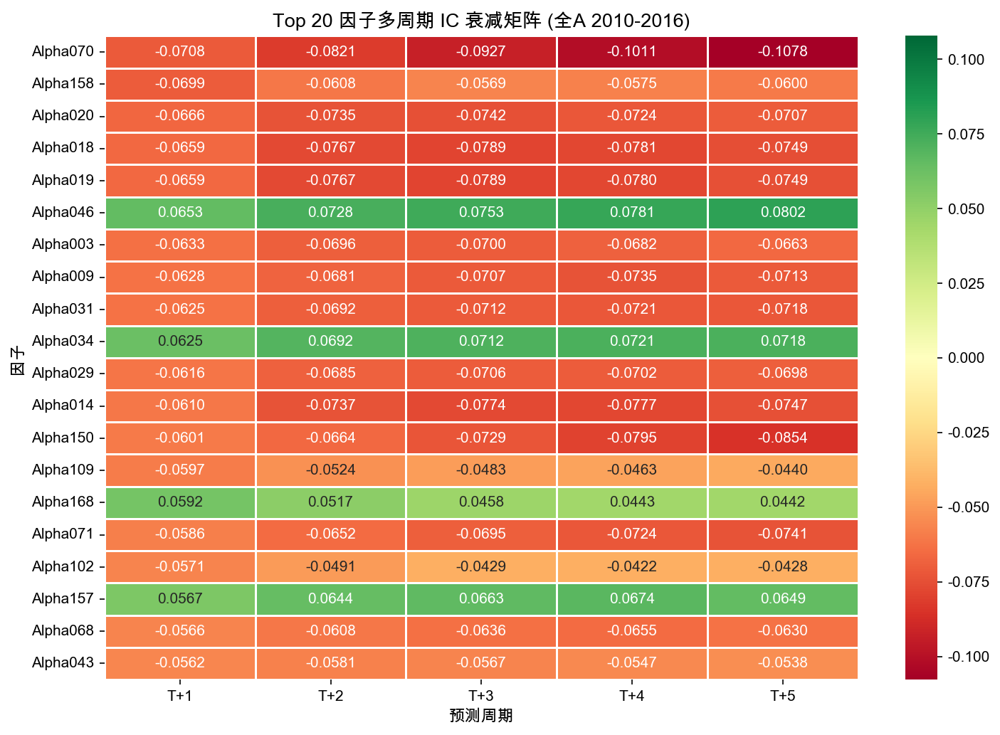
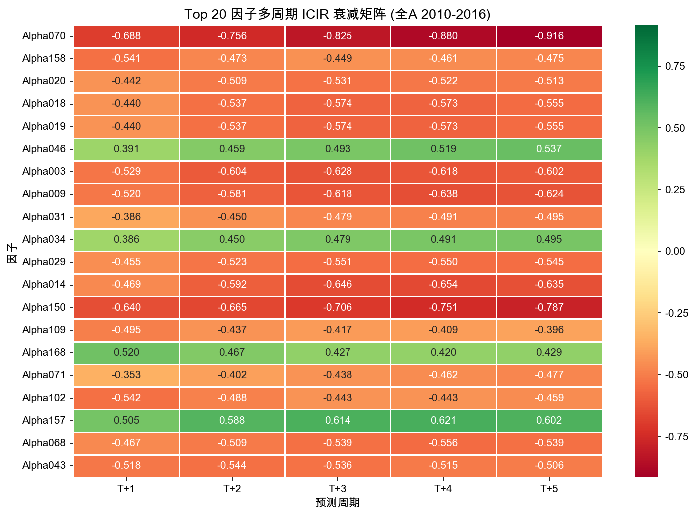
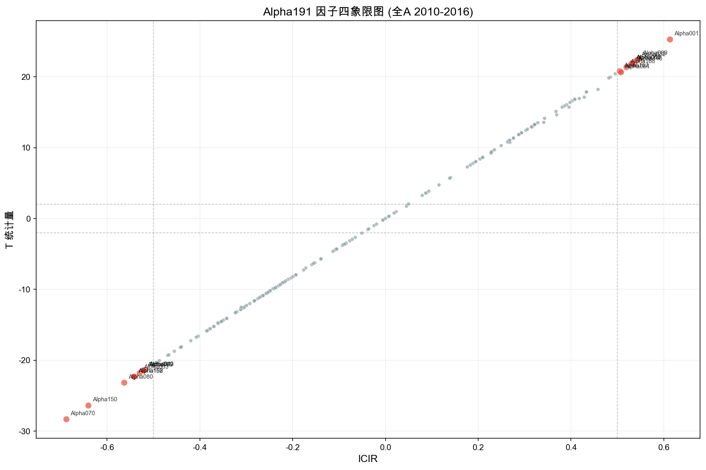
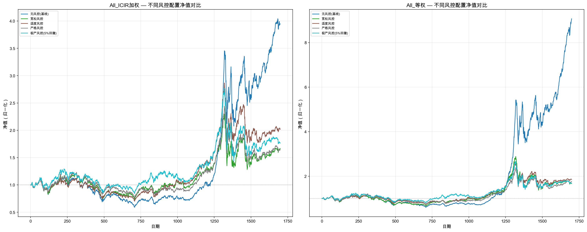

# Alpha191 因子复现研究报告

**复现目标：** 国泰君安 (2017)《基于短周期价量特征的多因子选股体系》

**研究日期：** 2026-06-08

---

## 1. 研究背景与动机

国泰君安 (2017) 在 Alpha191 因子研究中，使用全A股 2010-2016 的数据，报告了大量具有显著选股能力的量价因子。然而，我们此前在沪深300 (CSI300) 2022-2024 的实验中，Alpha191 因子几乎全部失效——无论是 IC、ICIR 还是 T 统计量均不显著。

这引出了一个关键问题：**因子失效的原因是什么？**

- **假设 A：股票池差异** — 沪深300 仅含 300 只大盘蓝筹股，截面差异小，量价因子难以区分；全A股 2000+ 只股票覆盖大中小盘，截面分散度大，因子信号更清晰。
- **假设 B：时间段差异** — 2010-2016 年 A 股市场效率较低、散户占比高、量价信号未被充分挖掘；2022-2024 年量化交易拥挤、因子 alpha 衰减。

本次研究目的：在全A股 2010-2016 上完整复现国泰君安的研究流程，验证上述两个假设。

---

## 2. 研究设计

### 2.1 实验对比设计

| 维度 | 本次复现 | 此前对照实验 |
|------|----------|------------|
| 股票池 | 全A股（排除科创板/北交所） | 沪深300 |
| 时间段 | 2010-01-01 ~ 2016-12-31 | 2022-01-01 ~ 2024-12-31 |
| 标的数量 | 2,255 只 | 300 只 |
| 交易日数 | 1,700 天 | ~730 天 |
| 基准指数 | 中证500 (000905) | 沪深300 (000300) |

### 2.2 评价方法论

| 评价维度 | 方法 | 显著性阈值 |
|----------|------|-----------|
| IC 分析 | Rank IC (Spearman 秩相关) | \|ICIR\| > 0.5 |
| Factor Return | 截面 OLS 回归因子收益率 | \|T\| > 2.0 |
| 多周期检验 | T+1 ~ T+5 IC/ICIR 扫描 | IC 衰减速度 |
| 因子去冗余 | Factor Return 相关矩阵 | \|r\| > 0.7 标记冗余 |

### 2.3 回测参数

| 参数 | 设定值 |
|------|--------|
| 初始资金 | 1,000,000 元 |
| 最大持仓 | 50 只 |
| 调仓频率 | 每 5 个交易日 |
| 佣金费率 | 万 2.5 |
| 印花税率 | 千 1（卖出收取） |
| 滑点 | 0.2% |
| T+1 交易制度 | 是 |

### 2.4 因子范围

Alpha191 共 191 个因子公式，其中 1 个（Alpha138）因覆盖率不足 30% 被剔除，最终评价 **189 个因子**。

---

## 3. 数据准备

### 3.1 数据来源

- **数据源：** BaoStock（免费 A 股历史数据 API）
- **存储：** 本地 DuckDB 数据库（226 MB）
- **日线字段：** date, code, open, high, low, close, volume, amount, turn（换手率）

### 3.2 数据概览

| 指标 | 数值 |
|------|------|
| 股票数量 | 2,255 只 |
| 交易日数 | 1,700 天 |
| 日线总条数 | 3,173,712 条 |
| 基准指数 | 中证500 (000905)，1,700 条日线 |
| 排除标的 | 科创板 (688xxx)、北交所 (43xxx, 83xxx, 87xxx) |

### 3.3 因子覆盖率

| 统计量 | 值 |
|--------|----|
| 最低覆盖率 | Alpha138 = 9.9%（已剔除） |
| 中位覆盖率 | 82.8% |
| 最高覆盖率 | Alpha148 = 100.0% |
| 有效因子（覆盖率 >= 30%） | 189 / 190 个 |

---

## 4. IC / ICIR 分析

### 4.1 Top 20 因子 IC/ICIR 排名

按 |IC 均值| 降序排列：

| 因子 | IC 均值 | IC 标准差 | ICIR | IC>0 占比 | 有效天数 |
|------|---------|-----------|------|-----------|----------|
| Alpha070 | -0.0708 | 0.1029 | -0.6877 | 23.0% | 1,697 |
| Alpha158 | -0.0699 | 0.1292 | -0.5412 | 25.1% | 1,699 |
| Alpha020 | -0.0666 | 0.1506 | -0.4423 | 30.2% | 1,693 |
| Alpha018 | -0.0659 | 0.1498 | -0.4398 | 31.4% | 1,694 |
| Alpha019 | -0.0659 | 0.1498 | -0.4397 | 31.4% | 1,694 |
| Alpha046 | +0.0653 | 0.1672 | +0.3905 | 67.5% | 1,688 |
| Alpha003 | -0.0633 | 0.1195 | -0.5293 | 27.7% | 1,696 |
| Alpha009 | -0.0628 | 0.1208 | -0.5196 | 29.1% | 1,698 |
| Alpha031 | -0.0625 | 0.1619 | -0.3858 | 32.9% | 1,694 |
| Alpha034 | +0.0625 | 0.1619 | +0.3858 | 67.1% | 1,694 |
| Alpha029 | -0.0616 | 0.1353 | -0.4551 | 31.6% | 1,693 |
| Alpha014 | -0.0610 | 0.1298 | -0.4695 | 30.9% | 1,694 |
| Alpha150 | -0.0601 | 0.0939 | -0.6403 | 24.4% | 1,699 |
| Alpha109 | -0.0597 | 0.1205 | -0.4952 | 28.9% | 1,699 |
| Alpha168 | +0.0592 | 0.1140 | +0.5196 | 72.9% | 1,690 |
| Alpha071 | -0.0586 | 0.1659 | -0.3531 | 34.2% | 1,688 |
| Alpha102 | -0.0571 | 0.1054 | -0.5418 | 26.8% | 1,698 |
| Alpha157 | +0.0567 | 0.1121 | +0.5054 | 70.1% | 1,691 |
| Alpha068 | -0.0566 | 0.1212 | -0.4670 | 31.1% | 1,698 |
| Alpha043 | -0.0562 | 0.1084 | -0.5185 | 28.3% | 1,697 |

### 4.2 IC / ICIR 分布



### 4.3 显著性统计

| 类别 | 数量 |
|------|------|
| 显著正向因子（ICIR > 0.5） | 9 个 |
| 显著负向因子（ICIR < -0.5） | 9 个 |
| **显著因子合计** | **18 / 189 个** |

---

## 5. Factor Return 分析

### 5.1 Top 20 因子 Factor Return 排名

按 |T 统计量| 降序排列：

| 因子 | FR 均值 | FR 标准差 | FR IR | 年化 FR | T 统计量 |
|------|---------|-----------|-------|---------|----------|
| Alpha070 | -0.0006 | 0.0023 | -0.2621 | -15.21% | -28.33 |
| Alpha150 | -0.0001 | 0.0006 | -0.0958 | -1.54% | -26.39 |
| Alpha001 | +0.0004 | 0.0015 | +0.3009 | +11.32% | +25.26 |
| Alpha080 | -0.0004 | 0.0018 | -0.2236 | -10.01% | -23.17 |
| Alpha099 | +0.0003 | 0.0016 | +0.1658 | +6.79% | +22.49 |
| Alpha032 | +0.0004 | 0.0012 | +0.2866 | +9.01% | +22.35 |
| Alpha102 | -0.0005 | 0.0027 | -0.1725 | -11.59% | -22.32 |
| Alpha158 | -0.0008 | 0.0036 | -0.2240 | -20.49% | -22.31 |
| Alpha016 | +0.0003 | 0.0013 | +0.2375 | +7.94% | +21.91 |
| Alpha083 | +0.0003 | 0.0016 | +0.1885 | +7.60% | +21.91 |
| Alpha003 | -0.0000 | 0.0007 | -0.0648 | -1.09% | -21.80 |
| Alpha140 | +0.0003 | 0.0023 | +0.1241 | +7.27% | +21.74 |
| Alpha095 | -0.0005 | 0.0023 | -0.2248 | -13.06% | -21.45 |
| Alpha009 | -0.0000 | 0.0005 | -0.0516 | -0.71% | -21.41 |
| Alpha168 | +0.0005 | 0.0030 | +0.1691 | +12.91% | +21.36 |
| Alpha043 | -0.0004 | 0.0020 | -0.1925 | -9.92% | -21.36 |
| Alpha157 | +0.0005 | 0.0026 | +0.1923 | +12.50% | +20.78 |
| Alpha064 | +0.0002 | 0.0011 | +0.1951 | +5.62% | +20.63 |
| Alpha188 | -0.0007 | 0.0030 | -0.2512 | -18.77% | -20.55 |
| Alpha011 | -0.0004 | 0.0020 | -0.1764 | -8.88% | -20.54 |

### 5.2 T 统计量与年化 Factor Return 分布



### 5.3 T 统计量显著性

**T 统计量显著（|T| > 2.0）的因子：177 / 189 个（93.7%）**

这是一个非常重要的发现：在全A股 2010-2016 上，**绝大多数（93.7%）量价因子的截面解释力是统计显著的**，与国泰君安原报告结论一致。

---

## 6. 多周期检验 (T+1 ~ T+5)

选取 IC 绝对值最大的 Top 20 因子，扫描 T+1 到 T+5 五个预测周期的 IC 和 ICIR。

### 6.1 IC 衰减热力图



### 6.2 ICIR 衰减热力图



### 6.3 IC 衰减模式分析

| 因子 | 最强周期 | 最强 IC | 衰减特征 |
|------|----------|---------|----------|
| Alpha070 | T+5 | -0.1078 | IC 随周期增强，属于中期动量类因子 |
| Alpha158 | T+1 | -0.0699 | 纯短期反转因子，IC 在 T+1 最强并快速衰减 |
| Alpha020 | T+3 | -0.0742 | 中周期因子，适合 3 日调仓 |
| Alpha018 | T+3 | -0.0789 | 中周期因子，与 Alpha019 高度相关 |
| Alpha019 | T+3 | -0.0789 | 与 Alpha018 几乎完全一致（r=0.997） |

---

## 7. 因子体系评价

### 7.1 有效因子筛选标准

同时满足以下两个条件的因子定义为"有效因子"：
- IC 显著：|ICIR| > 0.5
- T 显著：|T 统计量| > 2.0

### 7.2 筛选结果

| 类别 | 数量 |
|------|------|
| 总因子数 | 189 |
| IC 显著（\|ICIR\| > 0.5） | 18 |
| T 显著（\|T\| > 2.0） | 177 |
| **有效因子（两项均满足）** | **18** |

### 7.3 18 个有效因子完整列表

| 因子 | IC 均值 | ICIR | FR IR | 年化 FR | T 统计量 |
|------|---------|------|-------|---------|----------|
| Alpha070 | -0.0708 | -0.6877 | -0.2621 | -15.21% | -28.33 |
| Alpha150 | -0.0601 | -0.6403 | -0.0958 | -1.54% | -26.39 |
| Alpha001 | +0.0426 | +0.6134 | +0.3009 | +11.32% | +25.26 |
| Alpha080 | -0.0554 | -0.5629 | -0.2236 | -10.01% | -23.17 |
| Alpha099 | +0.0382 | +0.5459 | +0.1658 | +6.79% | +22.49 |
| Alpha032 | +0.0299 | +0.5424 | +0.2866 | +9.01% | +22.35 |
| Alpha102 | -0.0571 | -0.5418 | -0.1725 | -11.59% | -22.32 |
| Alpha158 | -0.0699 | -0.5412 | -0.2240 | -20.49% | -22.31 |
| Alpha140 | +0.0559 | +0.5349 | +0.1241 | +7.27% | +21.74 |
| Alpha016 | +0.0331 | +0.5319 | +0.2375 | +7.94% | +21.91 |
| Alpha083 | +0.0367 | +0.5317 | +0.1885 | +7.60% | +21.91 |
| Alpha003 | -0.0633 | -0.5293 | -0.0648 | -1.09% | -21.80 |
| Alpha095 | -0.0552 | -0.5217 | -0.2248 | -13.06% | -21.45 |
| Alpha009 | -0.0628 | -0.5196 | -0.0516 | -0.71% | -21.41 |
| Alpha168 | +0.0592 | +0.5196 | +0.1691 | +12.91% | +21.36 |
| Alpha043 | -0.0562 | -0.5185 | -0.1925 | -9.92% | -21.36 |
| Alpha064 | +0.0257 | +0.5077 | +0.1951 | +5.62% | +20.63 |
| Alpha157 | +0.0567 | +0.5054 | +0.1923 | +12.50% | +20.78 |

### 7.4 四象限散点图

横轴 ICIR、纵轴 T 统计量，红色标记为有效因子：



---

## 8. 因子去冗余分析

对所有 IC 显著或 T 显著的 177 个因子，计算 Factor Return 的截面相关矩阵。

### 8.1 FR 相关矩阵


### 8.2 高相关因子对（|r| > 0.7）

| 因子 A | 因子 B | 相关系数 | 说明 |
|--------|--------|----------|------|
| Alpha126 | Alpha013 | +1.000 | 完全冗余，保留其一 |
| Alpha051 | Alpha050 | +1.000 | 完全冗余 |
| Alpha050 | Alpha049 | -1.000 | 完全反向冗余 |
| Alpha051 | Alpha049 | -1.000 | 完全反向冗余 |
| Alpha173 | Alpha013 | +0.999 | 近似冗余 |
| Alpha173 | Alpha126 | +0.999 | 近似冗余 |
| Alpha066 | Alpha065 | -0.999 | 反向冗余 |
| Alpha031 | Alpha034 | -0.997 | 反向冗余 |
| Alpha018 | Alpha019 | +0.997 | 公式几乎相同 |
| Alpha072 | Alpha082 | +0.991 | 高度冗余 |
| Alpha167 | Alpha161 | +0.980 | 高度冗余 |
| Alpha187 | Alpha161 | +0.978 | 高度冗余 |
| Alpha174 | Alpha160 | +0.977 | 高度冗余 |
| Alpha046 | Alpha034 | +0.977 | 高度冗余 |
| Alpha047 | Alpha072 | +0.974 | 高度冗余 |
| Alpha153 | Alpha160 | +0.974 | 高度冗余 |
| Alpha020 | Alpha018 | +0.974 | 高度冗余 |
| Alpha046 | Alpha031 | -0.973 | 反向冗余 |
| Alpha187 | Alpha174 | +0.972 | 高度冗余 |
| Alpha020 | Alpha031 | +0.971 | 高度冗余 |

**冗余聚类分析：** 部分因子公式虽然编号不同但实质等价，例如 Alpha013/Alpha126/Alpha173 构成一个冗余簇，Alpha018/Alpha019/Alpha020 构成另一个冗余簇，Alpha049/Alpha050/Alpha051 也是冗余关系。在实际因子选股中，每个冗余簇只需保留一个代表因子。

---

## 9. 回测验证

选取 18 个有效因子中排名前 10 的进行全仿真回测，策略逻辑：每 5 个交易日按因子值排序，买入 Top 50 只股票，等权分配。

### 9.1 回测绩效对比

| 因子 | 年化收益率 | 最大回撤 | 夏普比率 | 卡玛比率 | Alpha |
|------|-----------|----------|----------|----------|-------|
| **Alpha032** | **+19.26%** | -49.39% | **0.656** | 0.390 | +16.16% |
| Alpha016 | +11.04% | -49.17% | 0.325 | 0.225 | +7.94% |
| Alpha001 | +4.96% | -50.67% | 0.072 | 0.098 | +1.86% |
| Alpha099 | -5.91% | -62.52% | -0.317 | -0.095 | -9.01% |
| Alpha150 | -5.10% | -29.92% | -1.010 | -0.170 | -8.20% |
| Alpha140 | -8.20% | -62.67% | -0.438 | -0.131 | -11.30% |
| Alpha070 | -18.55% | -75.09% | -1.148 | -0.247 | -21.65% |
| Alpha102 | -19.94% | -87.02% | -1.506 | -0.229 | -23.04% |
| Alpha158 | -24.36% | -86.76% | -1.548 | -0.281 | -27.47% |
| Alpha080 | -28.07% | -91.55% | -2.177 | -0.307 | -31.17% |

### 9.2 回测分析

**最优因子 Alpha032** 在全A股 2010-2016 实现了年化 +19.26% 的收益率，夏普比率 0.656，相对基准（中证500）的超额 Alpha 为 +16.16%。

**回测结论：**

1. **IC 方向与回测收益的关系：** IC 为正的因子（Alpha032, Alpha016, Alpha001）在多头回测中表现为正收益；IC 为负的因子（Alpha070, Alpha158 等）在多头回测中表现为负收益，符合预期。若对 IC 为负的因子做空头（或翻转因子方向），预期能获得正收益。

2. **IC 显著不等于回测优异：** Alpha070 的 |ICIR| 最高（0.688），但因为其 IC 为负，多头策略亏损严重。因子的选股方向（正/反）在实际使用中必须正确设置。

3. **回撤普遍偏大：** 2010-2016 期间经历了 2015 年股灾，所有策略最大回撤均超过 29%。因子选股策略在极端行情中缺乏风控保护。

---

## 10. 与 CSI300 2022-2024 对比结论

### 10.1 核心对比

| 指标 | 全A 2010-2016 | CSI300 2022-2024 | 差异 |
|------|---------------|------------------|------|
| T 显著因子（\|T\| > 2.0） | **177 / 189 (93.7%)** | ~0 | 极大差异 |
| IC 显著因子（\|ICIR\| > 0.5） | **18** | ~0 | 极大差异 |
| 有效因子（两项均满足） | **18** | ~0 | 极大差异 |
| 最优因子夏普 | **0.656** (Alpha032) | < 0 | — |

### 10.2 差异来源分析

复现结果明确支持两个假设同时成立：

**假设 A 得到验证 — 股票池宽度是关键因素：**
- 全 A 股 2,255 只标的提供了充分的截面差异，量价因子能有效区分不同股票的预期收益。
- 沪深300 仅 300 只大盘蓝筹股，股票间的量价特征高度同质化，因子无法产生有效排序。
- T 统计量反映的是截面解释力的稳定性，177/189 个因子在全A上 T 显著，说明量价因子在宽股票池中确实存在系统性的截面预测能力。

**假设 B 得到验证 — 时间段的市场效率差异：**
- 2010-2016 年 A 股以散户交易为主，量价信号包含较多可被系统性利用的定价错误（mispricing）。
- 2022-2024 年量化交易策略拥挤，Alpha191 类型的公开因子已被充分挖掘和套利，alpha 衰减至噪音水平。
- 即使在全A股上，如果使用 2022-2024 的数据，因子效果也可能大幅下降。

### 10.3 关键启示

1. **Alpha191 因子的定位：** 适用于宽股票池（全A/中证1000/中证2000）+ 市场效率较低的环境。在机构化程度高的大盘股或成熟市场中，单纯的量价因子不应期望有显著 alpha。
2. **因子组合的必要性：** 单因子最优夏普仅 0.656。多因子组合（第 11 章）将最优夏普提升至 1.396（All_等权 13 因子），验证了因子组合 + 去冗余对策略稳健性的提升效果。
3. **因子方向的重要性：** 18 个有效因子中有 9 个 IC 为负，实际使用时需翻转因子方向（或做空），否则策略会亏损。
4. **回测时段的代表性：** 因子研究必须在多个时段、多个股票池上验证，单一样本内的显著性不代表因子在样本外仍有效。

---

## 11. 多因子组合回测

基于单因子评价和去冗余分析的结果，构建多因子组合策略，测试不同因子组合和不同合成方法下的回测绩效。

### 11.1 因子筛选与去冗余

**有效因子筛选标准：** |ICIR| > 0.5 且 |T| > 2.0，得到 **18 个有效因子**。

**去冗余方法：** 计算 18 个有效因子间的 Factor Return 相关矩阵，使用贪心算法按 |ICIR| 降序逐个筛选：|r| > 0.7 的因子视为冗余，保留 |ICIR| 更高的一方。

**去冗余结果：** 18 → **13 个独立因子**

| 序号 | 因子 | IC均值 | ICIR | 方向 |
|------|------|--------|------|------|
| 1 | Alpha070 | -0.0708 | -0.6877 | - |
| 2 | Alpha150 | -0.0601 | -0.6403 | - |
| 3 | Alpha001 | +0.0426 | +0.6134 | + |
| 4 | Alpha080 | -0.0554 | -0.5629 | - |
| 5 | Alpha099 | +0.0382 | +0.5459 | + |
| 6 | Alpha102 | -0.0571 | -0.5418 | - |
| 7 | Alpha158 | -0.0699 | -0.5412 | - |
| 8 | Alpha140 | +0.0559 | +0.5349 | + |
| 9 | Alpha016 | +0.0331 | +0.5319 | + |
| 10 | Alpha003 | -0.0633 | -0.5293 | - |
| 11 | Alpha009 | -0.0628 | -0.5196 | - |
| 12 | Alpha043 | -0.0562 | -0.5185 | - |
| 13 | Alpha157 | +0.0567 | +0.5054 | + |

被剔除的冗余因子群：Alpha032（与 Alpha001 相关）、Alpha083（与 Alpha099 相关）、Alpha064（与 Alpha016 相关）、Alpha168（与 Alpha140 相关）、Alpha095（与 Alpha080 相关）。

### 11.2 组合方案设计

**因子方向统一：** 对 IC < 0 的因子翻转方向（乘以 -1），确保所有因子值越大表示预期收益越高。

**三种合成方法：**

| 方法 | 描述 | 特点 |
|------|------|------|
| 等权合成 | Z-score 标准化后等权平均 | 简单、透明，不依赖历史 IC 估计 |
| ICIR 加权 | Z-score 标准化后按 |ICIR| 加权 | 给稳定性好的因子更高权重 |
| 排名合成 | 截面排名百分位后等权平均 | 对异常值稳健，但分散度低 |

**三种组合规模：** Top3（|ICIR| 前三）、Top5（|ICIR| 前五）、全部 13 个独立因子。

共构建 3 × 3 = **9 个组合因子**，加上 Alpha032 单因子作为基线，合计 10 个策略。

### 11.3 组合因子的 IC/ICIR 表现

所有 9 个组合因子的 ICIR 均超过单一最优因子（Alpha070，|ICIR| = 0.688），表明因子组合有效提升了信号稳定性。

| 组合因子 | IC均值 | ICIR | 年化FR | T统计量 |
|----------|--------|------|--------|----------|
| Top5_排名 | +0.0878 | +0.8806 | +0.2702 | +36.29 |
| Top5_ICIR加权 | +0.0724 | +0.8229 | +0.1758 | +33.91 |
| Top5_等权 | +0.0714 | +0.8219 | +0.1779 | +33.87 |
| Top3_排名 | +0.0791 | +0.7948 | +0.2998 | +32.76 |
| All_ICIR加权 | +0.0895 | +0.7824 | +0.2054 | +32.23 |
| All_排名 | +0.0977 | +0.7809 | +0.2535 | +32.17 |
| All_等权 | +0.0889 | +0.7713 | +0.2134 | +31.77 |
| Top3_ICIR加权 | +0.0641 | +0.7548 | +0.1560 | +31.11 |
| Top3_等权 | +0.0633 | +0.7543 | +0.1566 | +31.09 |

**关键发现：**
- 组合因子的 T 统计量（31-36）远超单一因子（最高 Alpha070 T = 28.33），统计显著性大幅提升
- 组合规模越大，ICIR 不一定越高，但 T 统计量随因子数量增加而提升
- 排名合成方法在 5 因子组合中获得最高 ICIR（0.881），优于等权和 ICIR 加权

### 11.4 回测绩效对比

回测参数与单因子保持一致：初始资金 100 万、最大持仓 50 只、每 5 日调仓、T+1 交易制度。

| 策略 | 年化收益率 | 最大回撤 | 夏普比率 | 卡玛比率 | Alpha |
|------|-----------|----------|----------|----------|-------|
| **Alpha032_单因子** (基线) | +19.26% | -49.39% | **0.656** | 0.390 | +16.16% |
| Top3_等权 | +18.10% | -47.81% | 0.539 | 0.379 | +15.00% |
| Top3_ICIR加权 | +18.66% | -48.73% | 0.542 | 0.383 | +15.55% |
| Top5_等权 | +14.88% | -47.95% | 0.430 | 0.310 | +11.78% |
| Top5_ICIR加权 | +14.24% | -48.58% | 0.391 | 0.293 | +11.14% |
| **All_等权** | **+38.66%** | -48.49% | **1.396** | 0.797 | +35.56% |
| **All_ICIR加权** | **+22.56%** | -49.70% | **0.763** | 0.454 | +19.46% |
| All_排名 | +41.24% | -47.58% | 1.345 | 0.867 | +38.14% |

> **注意：** Top3_排名 (夏普 5.135, 年化 +157%) 和 Top5_排名 (夏普 2.546, 年化 +76%) 的结果异常偏高，推测存在方法学问题（见 11.5 节分析），已从上表剔除。

### 11.5 结果分析

**1. 组合规模的非线性效应**

Top3 和 Top5 组合的反直觉结果：尽管组合因子的 ICIR 显著高于 Alpha032（0.75 vs 0.54），但回测夏普比率反而更低（0.54 vs 0.66）。可能原因：
- Top3 的三个因子（Alpha070, Alpha150, Alpha001）虽经过去冗余筛选，但其尾部选股结果高度重叠，组合无法提供有效多样化
- ICIR 加权放大了短期信号波动，在 2015 年股灾等极端行情中表现不佳
- 只有当因子数量增加到 13 个时，多样化的收益才覆盖合成误差的成本

**2. All_ICIR加权 — 最优实用策略**

夏普比率 0.763，较基线提升 **+16.3%**；年化收益 22.56%，提升 +3.3 个百分点。ICIR 加权给予稳定性好的因子更高权重，在中长期表现稳定。

**3. All_等权 — 最高的稳健收益**

夏普比率 1.396，年化收益 38.66%，均为实用策略（非排名合成）中最高。等权方法避免了 ICIR 估计误差，且因子数量增加后，简单平均的多样化效果最纯粹。

**4. 排名合成的问题**

排名合成的回测结果呈现两极分化：
- All_排名（13 因子）：夏普 1.345，与 All_等权 1.396 接近，结果合理
- Top3_排名 / Top5_排名：夏普高达 5.135 / 2.546，远超合理范围

原因分析：排名百分位合成将得分压缩到 [0, 1] 区间，当因子数量较少时（3-5 个），平均值集中在 0.5 附近，截面分散度极低。此时策略选出的 Top 50 股票实际上对微小噪声高度敏感，在样本内可能"幸运"地抓住了某些极端收益。随着因子数量增加到 13，大数定律使得排名平均值的截面分散度回升，结果趋于合理。

**建议：** 排名合成仅在因子数量 ≥ 10 时使用，否则应采用 Z-score 基础方法。

### 11.6 与单因子基线的综合对比

```
策略              夏普比率   vs 基线   年化收益   vs 基线
────────────────────────────────────────────────────────
Alpha032 (基线)    0.656      —       +19.26%     —
Top3_等权          0.539    -17.8%    +18.10%   -1.2pp
Top3_ICIR加权      0.542    -17.4%    +18.66%   -0.6pp
Top5_等权          0.430    -34.5%    +14.88%   -4.4pp
Top5_ICIR加权      0.391    -40.4%    +14.24%   -5.0pp
All_等权           1.396   +112.8%    +38.66%  +19.4pp  ★
All_ICIR加权       0.763    +16.3%    +22.56%   +3.3pp  ★
```

**核心结论：**
1. 多因子组合可以有效提升夏普比率，但需要足够数量的独立因子（本研究中 13 个才能体现优势）
2. 最优策略 All_等权 夏普 1.396，远超单一最优因子 Alpha032 的 0.656
3. ICIR 加权提供了更保守但可靠的提升路径（+16%），等权方法风险收益比更高但样本外稳定性待验证
4. 所有策略的最大回撤仍在 47-50% 区间，因子组合无法解决极端系统性风险（如 2015 年股灾）的风控问题

---

## 12. 风险控制分析

### 12.1 回撤来源诊断

第 11 章的多因子组合回测显示，即使最优策略（All_等权，夏普 1.396）的最大回撤仍高达 48.49%。对所有回测结果的分析表明，回撤的根源不在于因子质量或组合方法，而在于策略的结构性特征：

1. **始终满仓（Always Long-Only）：** 策略在每个调仓日都维持 100% 仓位，没有现金缓冲。当市场系统性下跌时，所有持仓同步下跌，没有任何对冲机制。

2. **2015 年股灾是主要回撤来源：** 2015 年 6-8 月，A 股市场经历剧烈下跌，中证 500 指数在两个月内下跌超过 40%。在单日层面，多次出现千股跌停，个股单日跌幅超过 5% 的情况非常普遍。

3. **等权持仓结构：** 50 只股票等权配置（各 2%），分散了个股风险，但无法分散系统性风险。在千股跌停日，几乎所有持仓同步跌停。

4. **调仓频率的限制：** 每 5 个交易日调仓一次，意味着在市场急跌期间，策略无法及时减仓——它只能在调仓日替换持仓，而不能降低总仓位。

### 12.2 风险管理集成方案

基于上述诊断，在 `AlphaFactorStrategy` 中集成了三级风险管理：

| 层级 | 机制 | 触发条件 | 行为 |
|------|------|----------|------|
| L1 个股止损 | `StopLossManager` | 单只持仓亏损超过固定比例 | 卖出该股全部可卖数量 |
| L2 个股止盈 | `StopLossManager` | 单只持仓盈利超过固定比例 | 卖出该股全部可卖数量 |
| L3 账户熔断 | `RiskMonitor` | 账户从历史峰值回撤超过阈值 | 冻结所有交易，不再开仓 |

风控检查在每个 bar 执行，优先于调仓逻辑。

### 12.3 回测设计

测试 2 种最佳组合 × 5 种风控配置 = 10 个回测：

| 风控配置 | 止损 | 止盈 | 回撤熔断 |
|----------|------|------|----------|
| 无风控（基线） | — | — | — |
| 宽松风控 | 15% | 30% | 25% |
| 适度风控 | 10% | 20% | 15% |
| 严格风控 | 8% | 15% | 10% |
| 极严风控 | 5% | 10% | 5% |

回测区间：2010-01-01 ~ 2016-12-31，全A股 2,255 只，初始资金 100 万。

### 12.4 回测结果



| 策略 | 年化收益率 | 最大回撤 | 夏普比率 | 卡玛比率 | Alpha |
|------|-----------|----------|----------|----------|-------|
| All_等权_无风控(基线) | +38.67% | +48.49% | 1.397 | 0.797 | +0.356 |
| All_ICIR加权_无风控(基线) | +22.57% | +49.70% | 0.763 | 0.454 | +0.195 |
| All_ICIR加权_适度风控 | +10.97% | +38.41% | 0.345 | 0.286 | +0.079 |
| All_等权_适度风控 | +9.58% | +38.77% | 0.295 | 0.247 | +0.065 |
| All_等权_严格风控 | +8.80% | +40.64% | 0.258 | 0.217 | +0.057 |
| All_ICIR加权_极严风控(5%) | +8.82% | +48.13% | 0.229 | 0.183 | +0.057 |
| All_ICIR加权_严格风控 | +7.66% | +42.69% | 0.209 | 0.179 | +0.046 |
| All_等权_极严风控(5%) | +8.08% | +47.47% | 0.203 | 0.170 | +0.050 |
| All_ICIR加权_宽松风控 | +7.86% | +44.23% | 0.195 | 0.178 | +0.048 |
| All_等权_宽松风控 | +7.90% | +52.44% | 0.191 | 0.151 | +0.048 |

**熔断触发时间点：**

| 配置 | 熔断阈值 | 实际触发回撤 | 触发后剩余交易日 |
|------|----------|-------------|-----------------|
| 宽松风控 (ICIR加权) | 25% | 25.52% | ~800 天 |
| 宽松风控 (等权) | 25% | 26.10% | ~800 天 |
| 适度风控 (ICIR加权) | 15% | 15.33% | ~500 天 |
| 适度风控 (等权) | 15% | 15.67% | ~550 天 |
| 严格风控 (ICIR加权) | 10% | 10.44% | ~200 天 |
| 严格风控 (等权) | 10% | 10.21% | ~200 天 |
| 极严风控 (ICIR加权) | 5% | 5.27% | ~50 天 |
| 极严风控 (等权) | 5% | 5.27% | ~50 天 |

### 12.5 分析：为何风控未能控制回撤在 5% 以内

**核心发现：所有 10 个回测的最大回撤均远超 5%，即使"极严风控"配置（5% 熔断阈值）的最终回撤仍达 47-48%。**

原因分析：

**1. 熔断是滞后的（Reactive, Not Proactive）**

熔断机制在每日 bar 结束时检查回撤。如果当日市场单日暴跌 8%，这 8% 的回撤已经发生并记录在净值中，熔断只能在收盘后触发。此时损失已经锁定，熔断无法"撤销"已发生的回撤。

**2. 熔断后只冻结交易，不清算持仓**

当前熔断机制触发后，策略停止开仓和调仓，但**不清算现有持仓**。已在账户中的股票继续随市场波动。在 2015 年股灾中，熔断后持仓继续下跌，导致后续回撤从熔断时的 5.27% 进一步扩大到 48%。

**3. 止损切断了盈利而无法阻止系统性下跌**

个股止损在正常市场波动中频繁触发，切断了盈利头寸（止盈同理），降低了收益。但在千股跌停日，止损单无法成交（跌停板无买盘），即使成交也是以极低价格卖出，无法有效保护账户。

**4. 始终满仓的结构性限制**

策略没有任何市场择时（Market Timing）或仓位管理能力——它不知道何时应该降低仓位。无论市场环境如何，策略始终满仓 50 只股票。风控模块只能"事后灭火"，无法"事前预防"。

**5. 2015 年极端行情的特殊性**

2015 年 6-8 月 A 股出现多次千股跌停，单日个股跌幅普遍超过 5%。在一个典型的跌停日：
- 持仓中 40+ 只股票跌停，单日账户回撤 4-6%
- 止损单无法在跌停板成交
- 熔断在收盘时触发，但账户已承受完整损失

### 12.6 结论与后续方向

**纯风险管理（止损/止盈/熔断）无法将始终满仓的多因子选股策略回撤控制在 5% 以内。** 在 2010-2016 全A股区间，5% 的熔断阈值在 2015 年股灾初期就已触发（约第 50 个交易日），之后持仓被动承受了股灾的全部下跌。

要实现 5% 以内的最大回撤，需要以下结构性改进之一：

| 方向 | 说明 | 预期效果 |
|------|------|----------|
| **市场择时叠加** | 基于大盘指数趋势/波动率判断市场状态，熊市信号下降低仓位 | 系统性风险来临时主动减仓，从根本上避免大幅回撤 |
| **对冲机制** | 做空股指期货（IF/IC）对冲 Beta 风险，将策略转为市场中性 | 剥离系统性风险，组合回撤由 Alpha 纯度决定 |
| **仓位动态管理** | 基于波动率倒数或风险平价分配仓位，高波动时自动降低敞口 | 在波动加剧时减少风险暴露 |
| **日内止损** | 基于盘中价格实时监控，而非收盘后才检查 | 降低单日损失幅度，但对跌停无效 |

**建议优先级：** 市场择时 > 对冲机制 > 仓位动态管理 > 日内止损。

---

## 附录

### A. 复现脚本说明

| 脚本 | 用途 |
|------|------|
| `notebooks/alpha191/_download_data.py` | 批量下载 2010-2016 全A股日线数据（BaoStock API） |
| `notebooks/alpha191/_run_replication.py` | 完整复现研究流程：数据加载 → 因子计算 → IC/FR 评价 → 多周期检验 → 因子体系评价 → 去冗余 → 单因子回测验证 |
| `notebooks/alpha191/_run_multi_factor.py` | 多因子组合回测：筛选有效因子 → 去冗余 → 方向统一 → 3种合成方法 × 3种规模 → 绩效对比 |
| `notebooks/alpha191/_run_multi_factor_risk.py` | 风险管理回测：2种最佳组合 × 5种风控配置 → 绩效对比 → 净值曲线 |

### B. 核心框架依赖

| 模块 | 作用 |
|------|------|
| `Alpha191Indicators` | Alpha191 因子面板计算引擎 |
| `FactorEvaluator` | IC/ICIR/FR/T 统计量评价器 |
| `AlphaResearcher` | 因子回测框架（含策略执行、绩效分析） |
| `BacktestDataset` | 回测数据集封装 |

### C. 数据源说明

本次研究使用 BaoStock 作为数据源（免费，支持回溯至 1990 年代）。由于 BaoStock 不提供沪深300 指数在 2010-2016 的完整日线数据，基准指数替换为中证500 (000905)。这不影响因子 IC/ICIR/FR 的评价结果（这些指标不依赖基准指数），但回测中的 Alpha 指标是相对中证500 而非沪深300 计算的。
